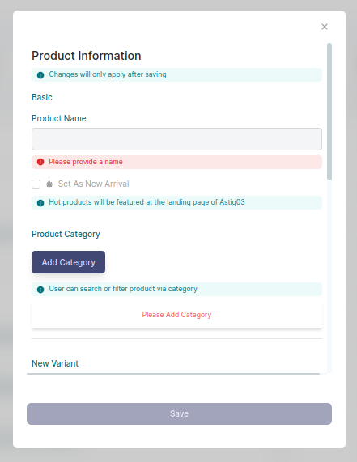

# Welcome To Astig03 Admin Guide

## Introduction
This guide will teach **Astig03 Admins** on how to perform actions to carefully manage the store website.

## Login Admin
To login using Admin Account, follow these steps:
1. **Step 1** Go to https://astig03.herokuapp.com/auth/admin_signin  it will direct to the Admin Login Account.

    

2. **Step 2** You can sign in via **Google** or via **Manual Signin**. 

    **NOTE:** On first time access, the developer will manually create an account for the root admin. This account is the main admin that the store **higher Admin personel** will use. This account can **create**, **update**, **delete** other admin accounts. If you don't know your account credential or you have trouble with your password. Contact the **Main Admin personel** of the store for help.

3. **Step 3** Once you successfully logged in, you will be redirected to the Astig03 Admin Dashboard, from this page you can now access admin actions such as Product Insights, Product & Management, Transactions, and Admin Account Management.

    

## Dashboard Insights
**Dashboard Insight** help admin to track the summary status of the store website. Number & Status of Orders & Products are calculated and shown. **Product Ranking** is also included to track product that sold the most or have higher generated earnings.

The **Order Statistics** only show the current summary of how many orders were **successfully** delivered to customer and the summary of **cancelled** orders per month in current year.

## Courier Management

Courier management let the user choose what courier they trust the most. Admin must add **atleast one** courier for the user to select.

### Creating Courier
1. **Step 1** Click New Courier

    

2. **Step 2** Fill all the information required

    

3. **Step 3** Save

### Editing Courier
1. **Step 1** Click courier you want to edit

2. **Step 2** Edit the information you want

    

3. **Step 3** Save

### Delete/Remve Courier

1. **Step 1** Hover on the courier

2. **Step 2** Find and click the **x** icon on the courier card you are hovering 

    

3. **Step 3** A promp will show to verify your decision.

    

## Categories Management
Categories is important in managing the products in the store. Categories let the users to **narrow down** their search. Also it is a great thing to categorize the products for easy identification on where a certain products belongs.

**Reminder:** The site require atlease 1 category. If failed to do so, the user cannot browse for categories and their search may not function well.

### Adding Categories
To create category follow these steps:

**Reminder:** Categories must not have duplicate category in the record list.

1. **Step 1** Go to **Categories Tab** on left panel
    

2. **Step 2** Click New Category
    

3. **Step 3** Fill information asked & **Save**

### Editing or Updating Categories
To edit/update category follow these steps:

**Reminder:** Categories you are updating must not have duplicate category in the record list.

1. **Step 2** Click the category you want to update
    

2. **Step 3** Update the information you want to change & **Save**

### Deleting Category

To delete, find the **x** icon on the right of the table list.
    

## Product Management
This is one of the **most important** part of the admin management. This contains the record of products that are available in store. This is also reflected to the user searches. Admin are maintaining and updating the product prices & information.

**Reminder:** It is important to add at least 1 product. If failed to do so, the customer cannot go to the product page to browse products.

### Creating New Product
**Reminder:** Product must have unique names

1. **Step 1** Click New Product
    

2. **Step 2** Fill all information required
    

3. **Step 3** After filling all information, click **Save**

### Updating Products
**Reminder:** Product must have unique names

1. **Step 1** Click the product you wanted to update

2. **Step 2** Change information you wanted to change
    

3. **Step 3** After filling all information, click **Save**

### Deleting Products

**Reminder:** Make sure you are sure to delete the product. This cannot be undone

1. **Step 1** Find the **x** icon on the product you wanted to delete

2. **Step 2**  **Confirm** your decision

## Customer Chat
The site let the user & admin **interract** to each other via the built in **chat system**. Admins can see user chat and answer their questions.

**Reminder:** Multiple Admin can reply to a single user, this enable other admin to monitor & have a knowledge to any ongoing transaction or conversations.
**Reminder:** Be respectful to the customer.

## Pending Orders
In this part of management, the admin must **check** the order request by clicking **View Order Details**, the admin must check if the store have the item. Then the admin must do an action, eithter **Accept** or **Decline** the order.

## Orders In Progress
In this part of management, the admin can view the accepter orders & currently **processing** & **shipped**. The admin must update their status accordingly. **Search** by **Order ID** is also provided incase a specific order is needed.

### Admin can update their status.
Admin must update their status

- **Processing -** The order is accepted, and the store is packaging the items.
- **Shipped -** The package has been given to the chosen courier
- **Mark as Delivered-** Before chosing this, wait for the courier to inform you that the parcel has been delivered to the customer. This will move the order into the **Delivered** order record

## Delivered Orders

In this part, all **Delivered** orders where listed, these contains all informations about the order. The admin can also **Search** orders by their **Order ID** if needed for reviewing.

## Admin Management
Admin management is important. In this part, **Root Admin** and **Admins** can manage other admins. This make sure that the store have a multiple admin employee that can manage the store system at the same time.

### Create/Register New Admin
Only the **Root Admin** and existing **Admins** can create another admin. Please contact them if you are a new admin to get your credentials.

If you are authorized admin, follow these steps in creating new admin:

1. **Step 1** From **Dashboard** under the **Account Management**. Click **Admin** & it will direct you to Astig03 Admins page where you can create, update another admin or your own admin account based on your account admin role. Just click **Create New Admin** with the plus icon button.

    

2. **Step 2** The new window form will pop-up. Fill in your Name, Email Address, Role either Admin or Root Admin and Password, make sure to fill up all the text field. Click ‘Save’.

    

3. **Step 3** After saving the account automatically appear on the Astig03 Admins Page.

### Delete an admin account

Due to security reasons, only **IT** personel can hard delete an Admin. This make sure that **accidental deletion** of other admin will be avoided. Any admin can't remove their account or any other admin account.

Only the employee that has been **Fired** or **Demoted** as admin will be deleted