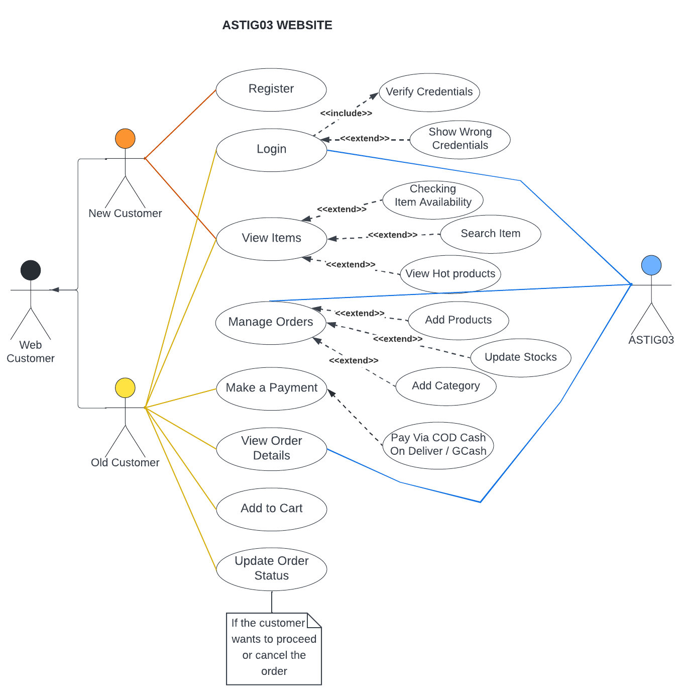
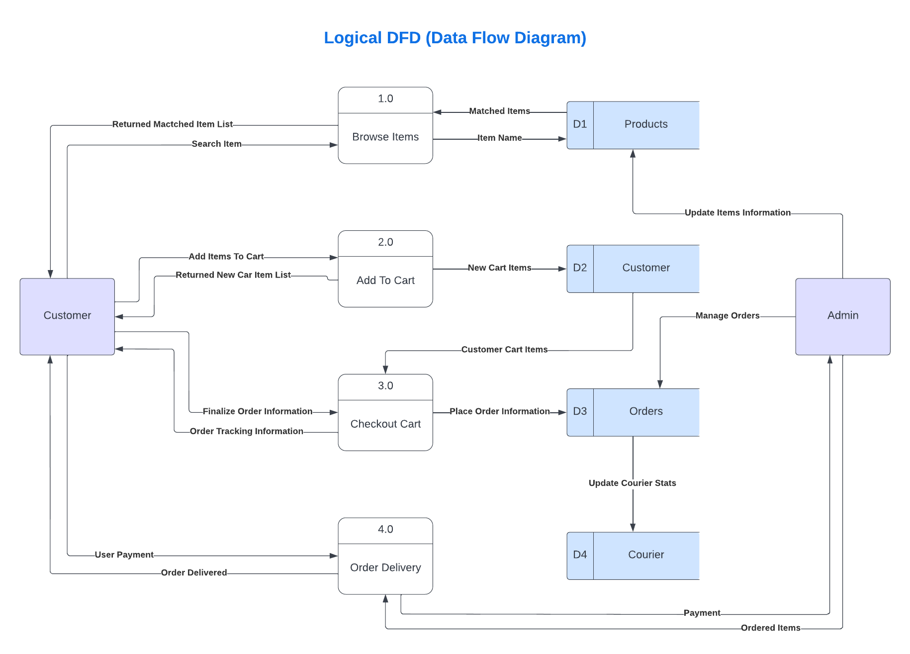
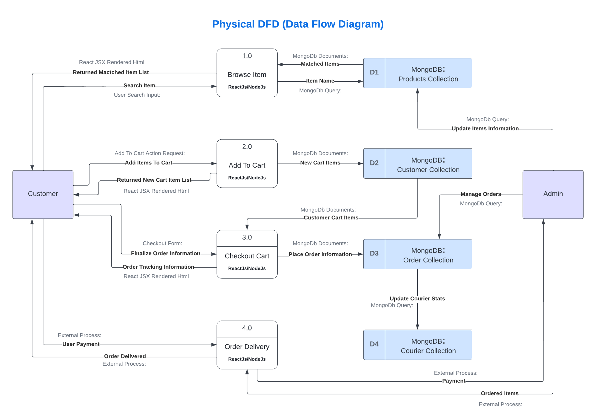
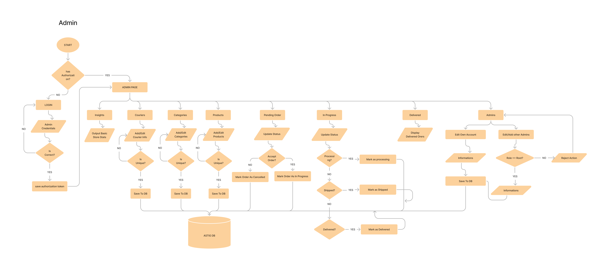
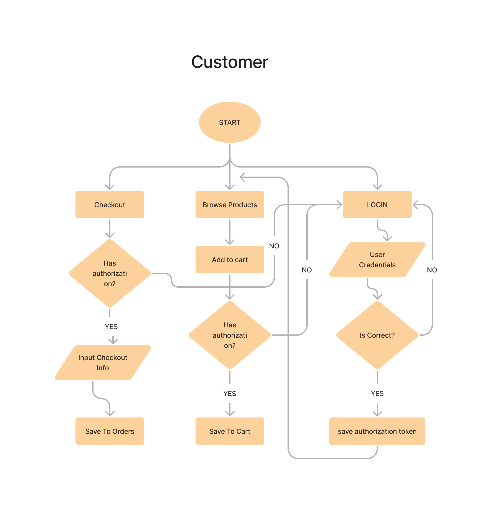
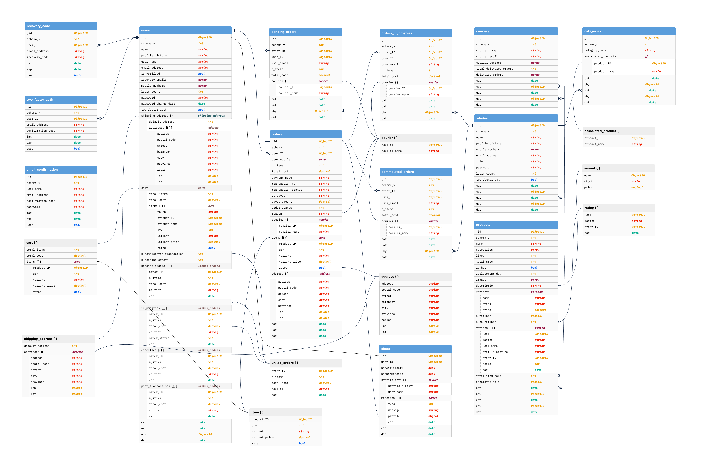
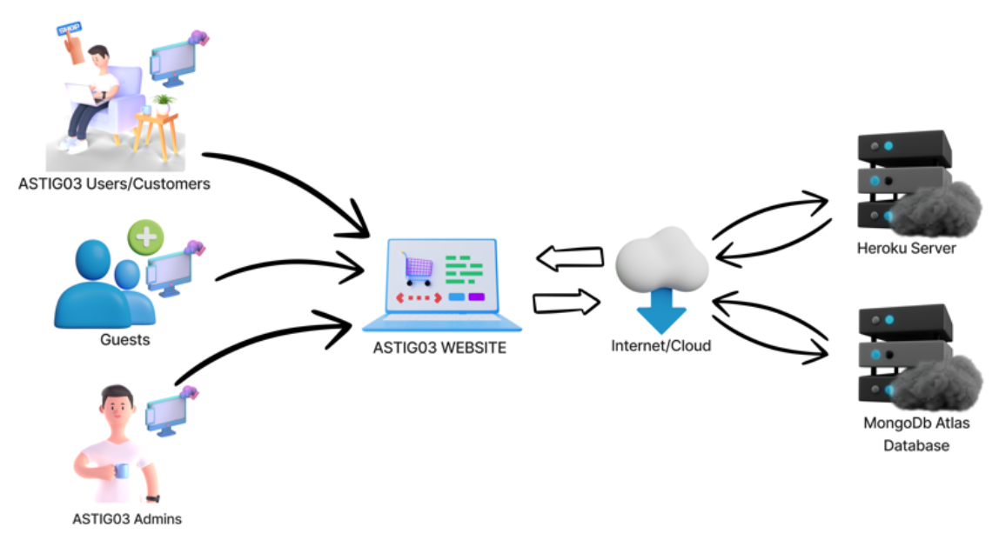

# Welcome To astig03 Developers Guide

## Introduction
There are a lot of ecommerce website out there to help business easily reach their customers. But this software is built specifically for astig03. This guide will provide the current developers the enough knowledge about the system help them in improving the site.

<hr>


## System Design


### Use Case Diagram

This show the summarized **flow of events** in astig03 website between the **user, system**, & the **admin**.




### Data Flow Diagram (Logical & Physical)

This show both **Logical & Physical** data flow diagram for improvement of future developers.





### Flow Chart

This shows the flow of the **customer** and the **admin** in astig03 website..




### Entity Relationship Diagram
Although MongoDb is **not** a relational,tabular database, we still provide a visualization of how the **Collections** and **Documents** relate to each others.



### System Architecture
astig03 uses **client server architecture**



## Technologies

This project is build using the following technology.

- [React.js](https://reactjs.org/)
- [Nodejs](https://nodejs.org/en/about/)
- [Mongoose](https://mongoosejs.com/)
- [Tailwind](https://tailwindcss.com/)
- [Windmill UI](https://windmillui.com/react-ui)
- [Flowbite](https://flowbite.com/)


## Repository

To run astig03 localy, we need to install required dependencies. Then we need to run astig03 backend & Front end

## Deployment

### Frontend & Backend
Both **Front End & Back End** where deployed to **Heroku**. Please ask the astig03 Heroku credential from the **astig03 Admin** or **astig03 IT Personel**.

### Database Deployment
The astig03 database is using **MongoDB** and it is deployed via **MongoDb Atlas**

The string bellow is the connection for the database. Ask the password from the **astig03 Admin** or **astig03 IT Personel**

```
mongodb+srv://Astig03:<password>@astigcluster.wbfp9.mongodb.net/AstigEcommerce?retryWrites=true&w=majority
```

## Requirements

Make sure you have **NPM**, **Node** installed in your system, **MongoDb Community Edition (Optional)** for local development.

## Installation
If you are a **developer** who is hired to **improve**, **fix bugs**, or **add features** to this website, follow the video or the instructions bellow. 


_Below is the process of setting up the front end and server._

1. In github, click the Green button with the text 'Code'. Choose Download Zip. or clone using git

```sh
git clone https://github.com/Senpai-Coders/Senpai-Coders-Astig-Ecommerce
```

2. Identify your pc local ip address by executing the command below.

   Ex: 192.168.1.2 192.168.1.5 etc.

   _linux_

   ```sh
   ifconfig
   ```

   _windows_

   ```sh
   ipconfig
   ```

3. Extract the downloaded repo from github. After extraction, open the extracted folder Senpai-Coders-Astig-Ecommerce using Visual Studio Code

4. Go to **AstigFront** folder and get the 'env copy' file from Jamiena Franza(Developer of Astig03) and change its name to **'.env'**

5. open .env file and replace 192.168.* . * with your pc IP address you got from step 2

6. Go to **AstigServer** folder and get the 'env copy' file from Jamiena Franza(Developer of Astig03) and change its name to **'.env'**. Note : this env is for the backend. Just like what you did before replace the ip 192.168.* . * with your pc ip from step 2

<hr>

Starting Frontend

1. Open terminal and execute the following command

   ```sh
   cd AstigFront;
   ```
   ```sh
   npm i;
   ```

   ```sh
   npm run dev
   ```
   
    Note: While starting the frontend, your default browser may open the automaticaly
<hr>

Starting Backend

1. Open a new terminal and execute the following command
   ```sh
   cd AstigServer
   ```
   ```sh
   npm i
   ```
   ```sh
   npm run dev
   ```
   The result must be
   ```sh
   Server running on port 3001
   Successfully connected to database
   ```

Open astig03 In Your Browser

User Page

    URL Format 'https://< youripaddress >:3000/'
    
    replace the < youripaddress > with your ip from step 2

    ex: https://192.168.1.2:3000


Admin Page
   
Thesame from user page but append /admin on last part of URL

    ex: https://192.168.1.2:3000/admin

