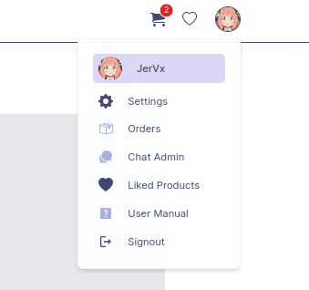

# Welcome To astig03 User Guide

## Introduction
Learn more about how to use astig03 Online Ordering System for your shopping & transactions.

## Register an account
To register/signup a new account, you can register/sign up via your **google account** or via **manual signup**:

### Via Google

Click Sign Up with google & a window will popup to let you choose your account

After choosing your google account, it will automatically login you to your astig03 account. astig03 will also email you for your **random generated password**. You can change this password via your **profile account setting**.

### Via Manual Sign Up
To sign-up account, follow these steps:

1. **Step 1** Navigate to the login page by clicking ‘Signin’ in the top left. You will directed to the signin page. If you have trouble finding signup page, [Click Here](https://astig03.herokuapp.com/auth/signup)

2. **Step 2** Click on the link ‘Sign Up’ it will direct to the astig03 Create Account page. Fill in your email address, password and confirm password, make sure to fill up all information needed. Click the Sign Up button to proceed.

3. **Step 3** The Email Verification will pop-up and will ask for a verification code, in order to proceed make sure to check the right code. Click ‘Confirm’ button.

4. **Step 4** Once you successfully logged in, you will be redirected to the astig03 Home page.

## How to Login

You can use your **google account** to signin to your account, or via **manual sign in**:

### Via Google
Click Signin with google & a window will popup to let you choose your account

After choosing your account, you will automatically login

### Via Manual Sign Up
To login/signin to your account, follow these steps:

1. **Step 1** First thing you need to do is navigate to astig03 Ordering System site at https://astig03.herokuapp.com it will direct to the main website.

2. **Step 2** In the top right of navigation menu, click the ‘Sign in’ Button. You will directed to the login page. If you have trouble finding the sign in page, [Click Here](https://astig03.herokuapp.com/auth/signin) 

3. **Step 3** Fill in your email address and password. Click the Sign in button to proceed.

4. **Step 4** If you have enabled your **two factor authentication** astig03 will ask for **two factor authentication code** that we sent you via your email. If you have not enabled **two factor authentication** in your profile settings, you will automatically logged in

5. **Step 5** Once you successfully logged in, you will be redirected to the astig03 Home page. From this page you can place new order, review your recent products and change or add basic information/details on your account. You can also chat the Admin for your concerns.

## Recover password

To recover your password, follow these instruction:

1. **Step 1** Navigate to the login page by clicking ‘Signin’ in the top left. You will directed to the Signin page

2. **Step 2** Click on the link ‘Recovery Account’ it will direct to the astig03 Recovery Account Page, if you have trouble finding the recovery page, [Click Here](https://astig03.herokuapp.com/auth/recover). Fill in your Email Address and New Password then click next button to proceed.

3. **Step 3** The Email Verification will pop-up and will ask for a **verification code** that we have sent you via your email address this code usually **expires** in **10 minutes**, before proceeding make sure that the code you provide is correct. Click ‘Confirm’ button.

4. **Step 4** Once you successfully logged in, you will be redirected to the astig03 Home page.

## How do I edit my account settings?
To edit your profile account make sure that you are already **logged in**, then follow these simple steps:  

1. **Step 1** In the top right navigation menu beside the cart icon click your profile picture and click ‘Setting’

    

2. **Step 2** Complete the presented form with the details you wish to alter. You can alter basic info. Contact#, Recovery Email, Shipping Address or Change Password.

    

3. **Step 3** Once you edit your account, there are other fields that are **saved automatically** and there are fields that have **save button** in order to save changes.

## Placing an order?
To place a new order, follow these steps:
1. **Step 1** From the Home page, click the ‘See Products’ button or click the ‘Products’ on the menu bar. This will direct you to the ‘Product Page’.

    

2. **Step 2** There are many choices in categories depends on what you want to order. You can search the product or choose the type of product under ‘Categories’ menu on the left hand navigation column then click a specific product you want. You will see the description of the specific product.

    

3. **Step 3** To order specific product, click on the quantity text field and type in the number required. Some product will display color, types and etc. that you can choice.

4. **Step 4** To add each product to the cart click ‘Add to Cart’ button. Repeat the process for each product you wish to add to your order.

## Check Cart & Transactions
1. **Step 1** In the top right navigation menu, you can click **Cart Icon** or you can click any of these. It will direct you to your profile overview page.

    

2. **Step 2** On the **MyCart** tab you will see the recent item, you have the ability to alter item by clicking the ‘View Product’ link. Check these quantities thoroughly as they cannot be changed once the order is placed. . If you change any of the quantities, be sure to click the ‘Add to Cart’ button to ensure the changes are affected.

    

3. **Step 3** Once you have reviewed your order and are satisfied that it is correct, click the **Checkout** button. This will advance you to the **Checkout Details** page where you will be able to finalize and submit your order. Click **Pace Order** to send your order request to store admin. 

    

4. **Step 4** You can also see the **Orders, Arrived Orders, & Cancelled** to monitor your order and **Status**.

    **Note**: You can only cancel your orders if the status is **Pending**

## Reach astig03 Admin

### Via Facebook
astig03 Only have [Facebook Page](https://www.facebook.com/Astig03-General-Merchandise-1908583755853358/) and you can contact us there.

### Via Built In Chat System**
astig03 have a built in chat system to make sure that the customer can interact with our admin and provide an answer to their query more quickly.

### Via Physical Sotre

We are located in 
**Dragon 8 mall Divisoria second floor 2f-12 C.M Recto cor. Dagupan st., Divisoria, Manila**
**Unit 74 Ground floor Acienda Designer Outlet Km. 48, Aguinaldo Hwy cor. Balubad Rd Brgy, Silang, 4118 Cavite**

We are open during
1. Location : (Dragon 8 mall) **[Monday - Saturday] - 7 AM to 8 PM**
2. Location : (Acienda) **[Monday - Friday] - 10 AM to 7 PM**

## Delete my account

**Unfortunately**, we have not included this feature to make sure that if your account get **hijacked** by a **hacker**, you will not loose all of your data incase they tried to **delete** your account. 

But you can file a **delete account request** by emailing us on **astig03.ecommerce@gmail.com** or you can chat with our **admins** directly on the **built in chat system** on the website. Though admin cannot delete a user, they can verify your identity and pass the deletion request to the **IT personel** of astig03, they are the only one who can **hard delete** any account in our store.